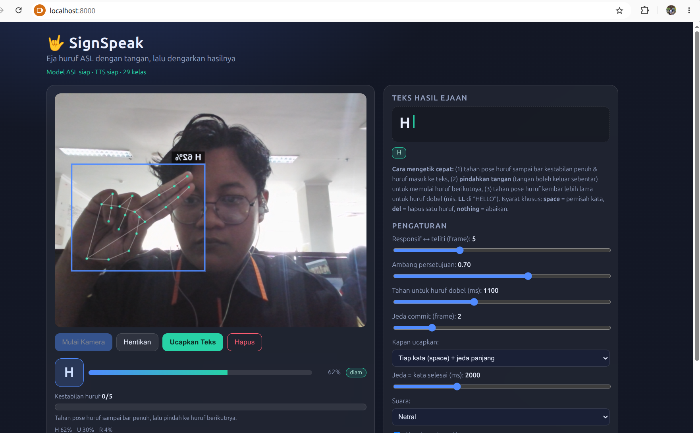

# 🤟 SignSpeak — Abjad ASL ➜ Suara

Aplikasi web yang **mengenali huruf bahasa isyarat ASL (A–Z) dari webcam**, menyusunnya
menjadi teks (kata ditulis **huruf demi huruf**, jadi memang harus menunggu), lalu
**mengucapkannya** memakai model TTS **SpeechT5** hasil fine-tuning pada **LJSpeech**
(`model_speecht5_ljspeech/`).

Model pengenalan huruf diambil dari proyek referensi
`/home/nizar/Downloads/ASL-Alphabet-Detection-main` (EfficientNet-B0, 29 kelas).

## 📸 Hasil



<sub>
Tangkapan layar aplikasi: webcam mendeteksi isyarat huruf **H** (keyakinan 62%, kandidat
lain U 30% & R 4%) dengan bounding box dan kerangka 21 landmark tangan, sementara panel kanan
menampilkan teks hasil ejaan, panduan mengetik cepat, dan kontrol kestabilan.
</sub>

## 🚀 Fitur Utama

- **Deteksi huruf real-time**: webcam browser → frame JPEG (base64) → backend →
  **MediaPipe HandLandmarker** (21 landmark tangan) → crop bounding box →
  **EfficientNet-B0** (29 kelas) → huruf + keyakinan + 3 kandidat teratas.
- **Komposisi kata bertahap (v2)**: karena modelnya **abjad**, satu kata butuh beberapa
  gestur. Huruf hanya di-*commit* bila **pose diam + stabil** (default 5 frame, ≥ 70%
  huruf sama, keyakinan ≥ 0,6, cooldown 2 frame).
- **Segmentasi gestur (motion gate)**: frame saat tangan sedang berpindah (bounding box
  bergeser / berubah ukuran) **diabaikan** dan buffer voting dikosongkan. Inilah kunci agar
  satu kata bisa ditulis banyak huruf tanpa huruf pertama saja yang terbaca.
- **Edge-triggered commit**: huruf hanya di-*commit* saat label **berubah** dari huruf
  sebelumnya, jadi menahan pose tidak menghasilkan huruf bertumpuk.
- **Tahan untuk huruf dobel**: menahan pose yang sama ±1,1 detik menghasilkan huruf kembar
  (mis. **LL** di "HELLO", **EE**, **OO**), lalu huruf berikutnya bisa langsung/normal.
- **Auto-speak sadar kata**: tidak lagi memotong di tengah kata. Kata diucapkan setelah
  isyarat `space`, atau setelah **tangan ditarik dari kamera** + jeda ±2 detik.
- **Indikator kestabilan**: bar progres "kandidat/vote" + status `diam`/`bergerak` +
  petunjuk singkat (mis. "tahan lebih lama untuk huruf dobel") di panel kamera.
- **Isyarat khusus** (ikut model referensi):
  - `space` → pemisah kata
  - `del` → hapus satu huruf
  - `nothing` → abaikan (tangan tanpa isyarat)
- **Ucapkan otomatis**: setelah jeda ±1,6 detik tanpa huruf baru, kata yang sudah
  selesai disintesis menjadi suara dan diputar otomatis. Bisa juga manual lewat
  tombol **Ucapkan Teks**.
- **Overlay**: bounding box + label + kerangka 21 sendi tangan di atas video.
- **Multi speaker**: 4 preset speaker embedding 512-dim (Netral / Pria / Wanita / Lambat).
- **Riwayat audio**: tiap ucapan punya player + tautan unduh `.wav`.
- **Kontrol stabilitas** lewat slider (window, ambang persetujuan, cooldown).

## 🧠 Cara Kerja (Pipeline)

```
Webcam (browser)
   │  frame JPEG (base64, ±90 ms)
   ▼
POST /api/detect ──► MediaPipe HandLandmarker (model-asl/hand_landmarker.task)
   │                     └─► 21 landmark tangan + bounding box (padding 0.05)
   │                             └─► crop 128×128 → normalisasi /255
   │                                     └─► EfficientNet-B0 (model/efficientnet_model.pth)
   │                                             └─► softmax 29 kelas (A-Z + del/nothing/space)
   │                                                     └─► valid bila conf ≥ 0.65
   │                                                     └─► LetterStabilizer (window 6, ≥70%, cooldown 8)
   │                                                             └─► commit 1 huruf → TextBuffer
   ▼
TextBuffer (space/del/nothing) ──► idle ≥1.6 s ATAU tombol "Ucapkan"
   ▼
SpeechT5 (fine-tune LJSpeech) + HiFi-GAN → WAV 16 kHz → diputar + masuk riwayat
```

## 🗣️ Tentang Model TTS

Model TTS dilatih pada **LJSpeech (bahasa Inggris, huruf kecil)**. Karena teks hasil
ejaan berupa huruf kapital (`HALO`), `normalize_for_tts()` otomatis mengubahnya jadi
ejaan per huruf (`H A L O.`) agar TTS **mengeja** dengan natural, bukan membacakan
akronim. Teks biasa lowercase/angka (`halo 123`) tetap dibaca sebagai kata.

## 🛠️ Tech Stack

- **Backend**: Python 3.11, FastAPI, Uvicorn
- **Computer Vision**: MediaPipe Tasks (`HandLandmarker`), OpenCV
- **ML**: PyTorch (CPU) + `efficientnet-pytorch` (EfficientNet-B0), 🤗 Transformers
- **Audio**: `soundfile` (WAV 16 kHz PCM16)
- **Frontend**: HTML5 + Vanilla JS/CSS (dark + glassmorphism)

## 📁 Struktur Proyek

```
wicHandSign/
├── model/
│   └── efficientnet_model.pth      # bobot ASL 29 kelas (dari proyek referensi)
├── model-asl/
│   └── hand_landmarker.task        # MediaPipe HandLandmarker
├── model_speecht5_ljspeech/        # TTS SpeechT5 hasil fine-tuning LJSpeech
├── backend/
│   ├── main.py                     # FastAPI: /api/detect, /api/speak, static
│   ├── asl_model.py                # EfficientNet-B0 29 kelas + HandLandmarker + crop
│   ├── spell_engine.py             # LetterStabilizer + TextBuffer (space/del/nothing)
│   └── tts_engine.py               # SpeechT5 + HiFi-GAN, normalisasi teks, speaker preset
├── static/
│   ├── index.html                  # UI webcam, teks ejaan, pengaturan, riwayat
│   ├── css/style.css
│   └── js/app.js
├── data/test_images/               # 29 gambar contoh huruf (untuk selftest)
├── result/
│   └── result.png                  # tangkapan layar aplikasi (dipakai di README)
├── tools/
│   ├── selftest_engine.py          # uji logika ejaan + normalisasi TTS (tanpa kamera)
│   └── selftest_images.py          # uji klasifikasi pada gambar contoh
├── requirements.txt
└── run.sh
```

## 🚀 Menjalankan

```bash
./run.sh                # buat venv bila perlu, lalu jalankan server
# buka http://localhost:8000  (kamera hanya boleh di localhost/HTTPS)
```

Variabel lingkungan opsional:

```bash
HANDSIGN_WINDOW=5            # jumlah frame untuk kestabilan huruf
HANDSIGN_AGREEMENT=0.7       # proporsi huruf sama minimum
HANDSIGN_COOLDOWN=2          # jeda antar commit huruf (frame)
HANDSIGN_MIN_CONF=0.6        # keyakinan minimum
HANDSIGN_REPEAT_HOLD_MS=1100 # tahan pose sama selama ini -> huruf dobel (0 = mati)
HANDSIGN_SPEAK_MODE=space+idle  # space | space+idle | idle | manual
HANDSIGN_WORD_IDLE_MS=2000   # jeda (tangan di luar kamera) -> selesai mengetik
HANDSIGN_MOTION_SHIFT=0.055  # toleransi pergeseran bbox agar dianggap "diam"
HANDSIGN_MOTION_SCALE=0.22   # toleransi perubahan ukuran bbox agar dianggap "diam"
HANDSIGN_MAX_TEXT=60         # panjang teks maksimum
```

## 🧪 Skrip Uji

```bash
# logika ejaan v2: motion gate, edge-trigger, repeat-hold, space/del, auto-speak
.venv/bin/python tools/selftest_engine.py

# klasifikasi huruf pada 29 gambar contoh (butuh model ASL + MediaPipe)
.venv/bin/python tools/selftest_images.py
```

Hasil `selftest_images.py` pada gambar demo referensi: 23/29 gambar tangan terdeteksi,
16 di antaranya terklasifikasi benar (gambar demo sudah berupa crop tangan, jadi
sebagian tidak lolos deteksi MediaPipe).

## 🔌 API

| Method | Endpoint | Keterangan |
|---|---|---|
| GET  | `/api/status` | status model ASL & TTS, daftar kelas, speaker |
| POST | `/api/detect` | `{image: dataURL, speak?: bool}` → prediksi huruf + teks ejaan (+ audio) |
| POST | `/api/speak`  | `{text, speaker?}` → `{audio: base64 WAV, spoken_text}` |
| POST | `/api/settings` | `{window?, agreement?, cooldown?, repeat_hold_ms?, speak_mode?, word_idle_ms?, speaker?}` |
| POST | `/api/reset` | hapus teks ejaan sesi |
| GET  | `/api/text`   | teks ejaan terkini |

Sesi ejaan dipisahkan per klien lewat header `X-Client-Id`.

## 📌 Catatan

- **Cara mengetik yang benar (penting)**: tahan pose huruf sampai bar kestabilan penuh
  (huruf masuk ke teks) → **pindahkan/turunkan tangan** → pose huruf berikutnya.
  Jangan berganti pose terlalu cepat, dan Jangan holding gantung di tengah;Huruf
  yang tertinggal bisa dihapus dengan isyarat `del`.
- **Kalau masih sering gagal**, turunkan slider "Responsif ↔ teliti" ke 3–4,
  turunkan "Ambang persetujuan" ke 0,6, dan naikkan "Tahan untuk huruf dobel".
  Sebaliknya kalau huruf salah terus masuk, naikkan ambang ke 0,8.
- **Akurasi huruf** bergantung pada pencahayaan, posisi tangan, dan latar belakang;
  hanya tangan pertama yang terdeteksi yang dipakai.
- **Kamera depan laptop** sering membaca tangan terbalik. Video di-mirror hanya di
  sisi browser (overlay ikut ter-mirror), server memproses frame apa adanya.
- **TTS butuh internet saat pertama kali** untuk mengunduh tokenizer
  (`microsoft/speecht5_tts`) dan vocoder (`microsoft/speecht5_hifigan`); setelah
  ter-cache berjalan offline. Inferensi TTS di CPU: ucapan pertama beberapa detik.
- TTS dilatih pada **Inggris** — huruf/kata Indonesia terdengar mengikuti fonetik Inggris.
